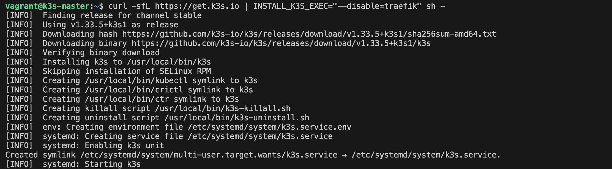
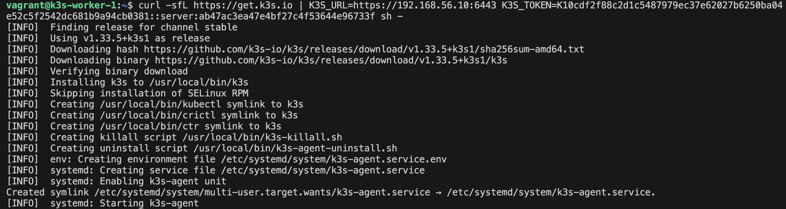
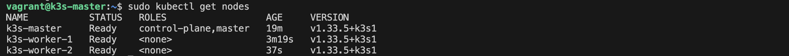
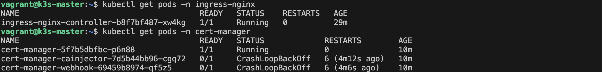
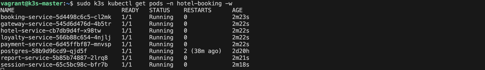
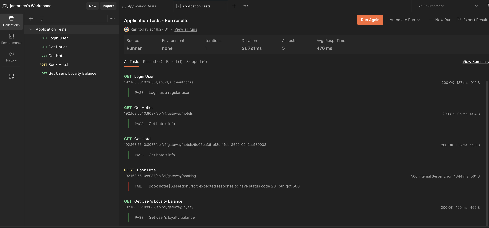
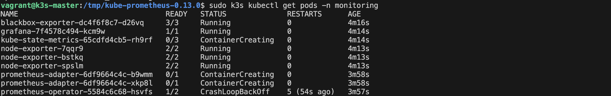

## Развертывание собственного кластера k3s

Для начала создаем структуру папок для k8s манифестов. Создаем vagrantfile для 3 нод и поднимаем их с ```vagrant up```.



Подключаемся к master ноде ```vagrant ssh k3s-master``` и устанавливаем k3s с отключенным Ingress Controller Traefik. Получаем токен для подключения worker нод ```sudo cat /var/lib/rancher/k3s/server/node-token```.



Устанавливаем k3s в режиме агента для воркеров.



Проверка кластера. На master устанавливаем Nginx Ingress Controller ```sudo kubectl apply -f https://raw.githubusercontent.com/kubernetes/ingress-nginx/controller-v1.8.2/deploy/static/provider/baremetal/deploy.yaml```
Были проблемы с установкой, поэтому использовался Helm. После устанавливаем cert-manager:
```kubectl apply -f https://github.com/cert-manager/cert-manager/releases/download/v1.14.4/cert-manager.yaml```



Запущены Nginx Ingress Controller и cert-manager.

Создаем манифест postgres-pv и применяем его на мастере ```sudo k3s kubectl apply -f /vagrant/src/k8s/databases/postgres-pv.yaml```, после создаем директорию для данных и даем права ```sudo mkdir -p /data/postgres && sudo chmod 777 /data/postgres```. Разворачиваем бд ```sudo k3s kubectl apply -f /vagrant/src/k8s/databases/``` и сервисы ```sudo k3s kubectl apply -f /vagrant/src/k8s/services/```

Пришлось установить docker, чтобы собрать сервисы по докерфайлам непосредственно на вм, а затем импортировать tar файлы в k3s containerd.

```

for service in booking-service gateway-service hotel-service loyalty-service payment-service report-service session-service; do
  echo "Building $service..."
  cd $service
  sudo docker build -t $service:latest .
  cd ..
done

for service in booking-service gateway-service hotel-service loyalty-service payment-service report-service session-service; do
  sudo docker save $service:latest -o /tmp/$service.tar
done

for service in booking-service gateway-service hotel-service loyalty-service payment-service report-service session-service; do
  sudo k3s ctr images import /tmp/$service.tar
done

```

После перезапускаем deployment ```sudo k3s kubectl rollout restart deployment -n hotel-booking``` и проверяем статус ```sudo k3s kubectl get pods -n hotel-booking```



Сервисы запущены.



Тесты Postman.



Prometheus Operator запущен и работает на одной реплике.